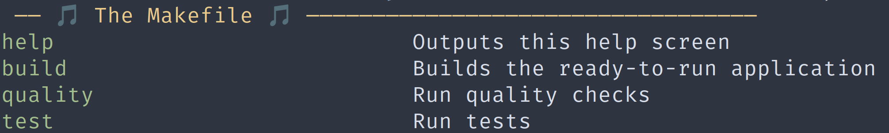
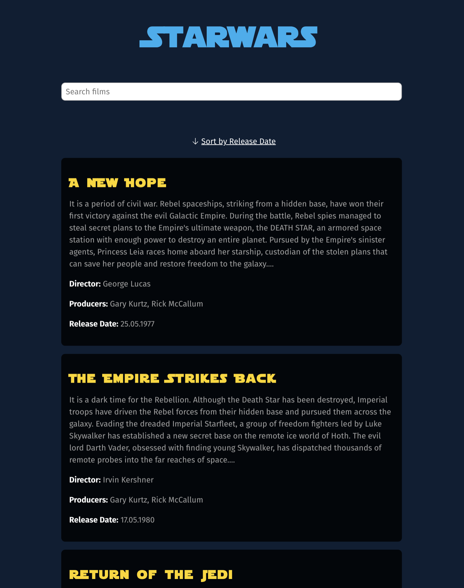
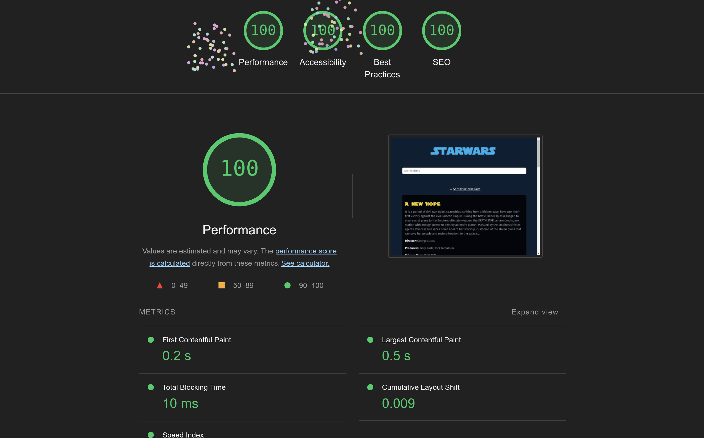

# Starwars

Just a simple Starwars project for fun :)

## Installation

### Requirements

- PHP 8.2
- Composer
- Yarn or NPM
- Symfony CLI

If you don't have Symfony CLI installed, you can find the installation
instructions [here](https://symfony.com/download).
Or you can just use whatever local webserver you have installed.

### Instructions

There is a Makefile.
See all available commands with:

```bash
make help
```



```bash
git clone git@github.com:MichaelBrauner/starwars.git starwars
cd starwars
make build
symfony serve -d
```

Now you can access the project under [https://127.0.0.1:8000](https://127.0.0.1:8000)

### Code Quality

I use the following tools for code quality.
You can run them all with the following make command:

```bash
make quality
```

#### PHPStan

I use PHPStan and Psalm for static code analysis. You can run it with the following command:

```bash
vendor/bin/phpstan analyse
vendor/bin/psalm
```

### Coding Standards

I use symplify/easy-coding-standard for code style checks. You can run it with the following command:

```bash
vendor/bin/ecs 
```

### Tests

I implemented a simple Smoke-Test. You can run it with the following command:

```bash
bin/phpunit
```

### Images





